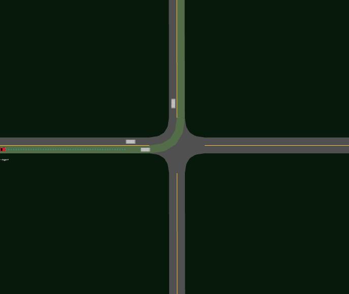

# Intersection
This example illustrates the training of an ego agent to make an unprotected left turn at an all-way-stop intersection with traffic, using the [Stable Baselines3](https://github.com/DLR-RM/stable-baselines3) reinforcement-learning library. Here, the PPO algorithm is used.

The ego agent earns reward for the distance travelled per-step and is penalised for colliding with other vehicles, for going off-road, for going off-route, or for driving on road-shoulder.

This example is only meant to demonstrate the use of SB3 library with SMARTS task environments. The trained agent does not solve the task environment.

## Trained agent making an uprotected left turn


## Observation space
+ Topdown RGB image
    + size (width x height): 112 pixels x 112 pixels
    + resolution: 50 meter / 112 pixel
```
observation_space = gym.spaces.Box(low=0, high=255, shape=(3, 112, 112), dtype=np.uint8)
```

## Action space
+ Throttle: [0,1]
+ Brake: [0,1]
+ Steering: [-1,1]
```
action_space = gym.spaces.Box(low=-1.0, high=1.0, shape=(3,), dtype=np.float32)
```

## Setup
```bash
$ git clone https://github.com/huawei-noah/SMARTS.git
$ cd <path>/SMARTS/examples/rl/intersection
$ python3.7 -m venv ./.venv
$ source ./.venv/bin/activate
$ pip install --upgrade pip
$ pip install -e .
```

## Colab
1. Try it here [](https://colab.research.google.com/github/huawei-noah/SMARTS/blob/intersection-v0/examples/rl/intersection/intersection.ipynb)

## Train
1. Train
    ```bash
    $ cd <path>/SMARTS/examples/rl/intersection
    $ python3.7 run.py 
    ```
1. Trained model is saved into `<path>/SMARTS/examples/rl/intersection/logs/<folder_name>` folder.
1. Monitor the RL agent during or after the training using tensorboard
    ```bash
    $ cd <path>/SMARTS/examples/rl/intersection
    $ tensorboard --logdir ./logs/
    ```

## Evaluate
1. Start
    ```bash
    $ cd <path>/SMARTS/examples/rl/intersection
    $ scl envision start --scenarios ./.venv/lib/python3.7/site-packages/scenarios/intersections &
    ```
1. Run
    + Evaluate your own model 
        ```bash
        $ python3.7 run.py --mode=evaluate --model="./logs/<folder_name>/<model>" --head
        ```
    + Evaluate pre-trained agent
        ```bash
        $ curl -o ./logs/pretrained/intersection.zip --create-dirs -L https://github.com/Adaickalavan/SMARTS-zoo/raw/main/intersection-v0/PPO_6200000_steps.zip
        
        $ curl -o ./logs/pretrained/intersection.zip --create-dirs -L https://github.com/Adaickalavan/SMARTS-zoo/raw/main/intersection-v0/best_model.zip   

        $ curl -o ./logs/pretrained/intersection.zip --create-dirs -L https://github.com/Adaickalavan/SMARTS-zoo/raw/main/intersection-v0/PPO_5800000_steps.zip
        
        $ python3.7 run.py --mode=evaluate --model="./logs/pretrained/intersection" --head
        ```
1. Go to `localhost:8081` to view the simulation in Envision.

## Docker
1. Train a model inside docker
    ```bash
    $ cd <path>/SMARTS
    $ docker build --file=./examples/rl/intersection/Dockerfile --network=host --tag=intersection .
    $ docker run --rm -it --network=host --gpus=all intersection
    (container) $ cd /src/examples/rl/intersection
    (container) $ python3.7 run.py
    ```